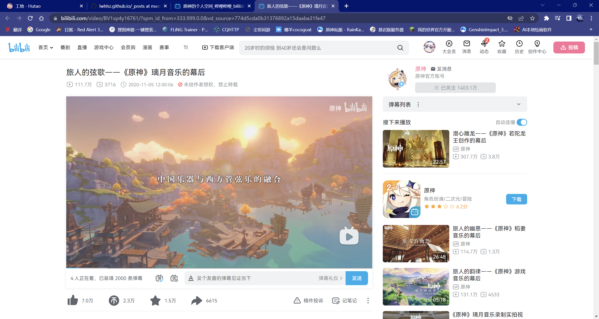
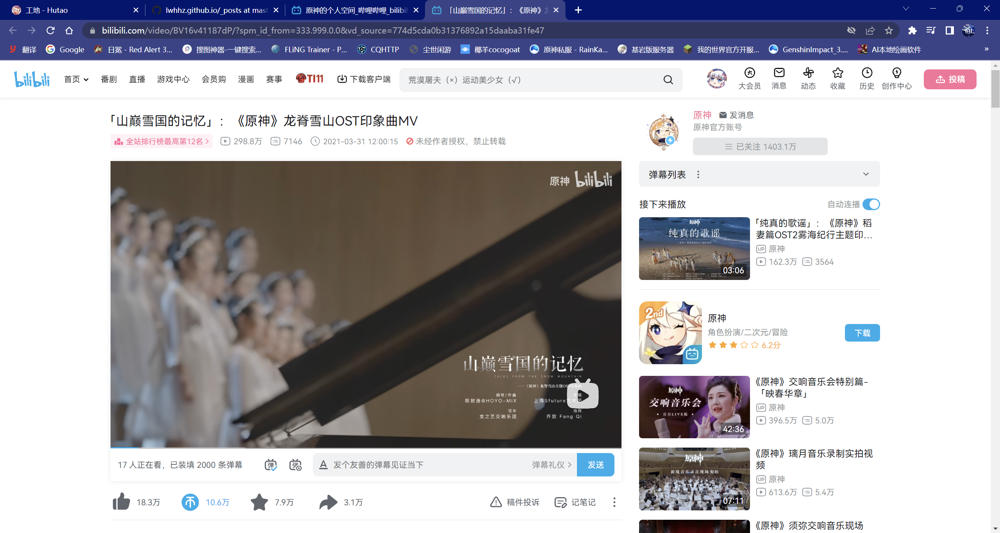
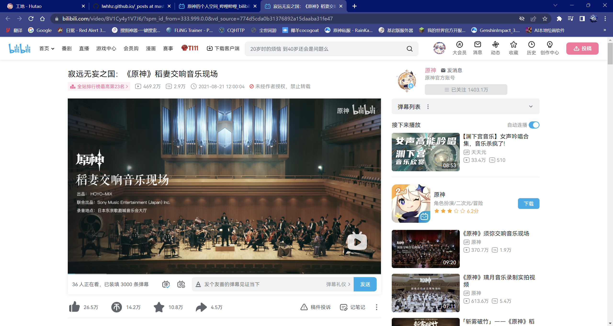
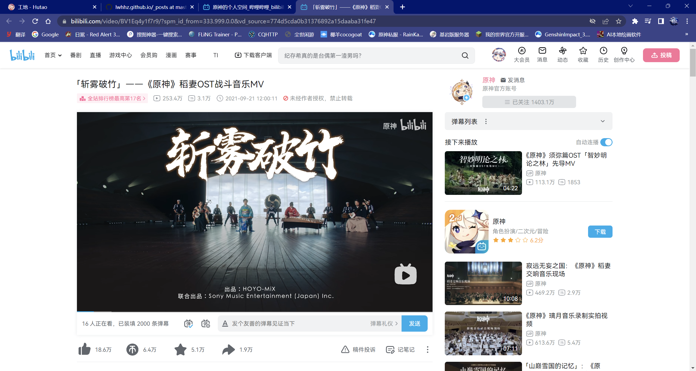
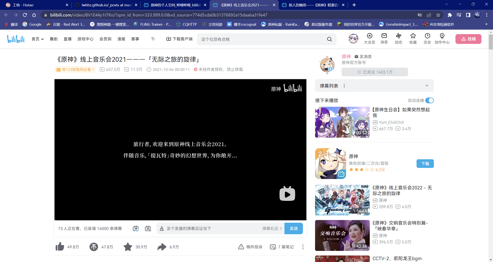
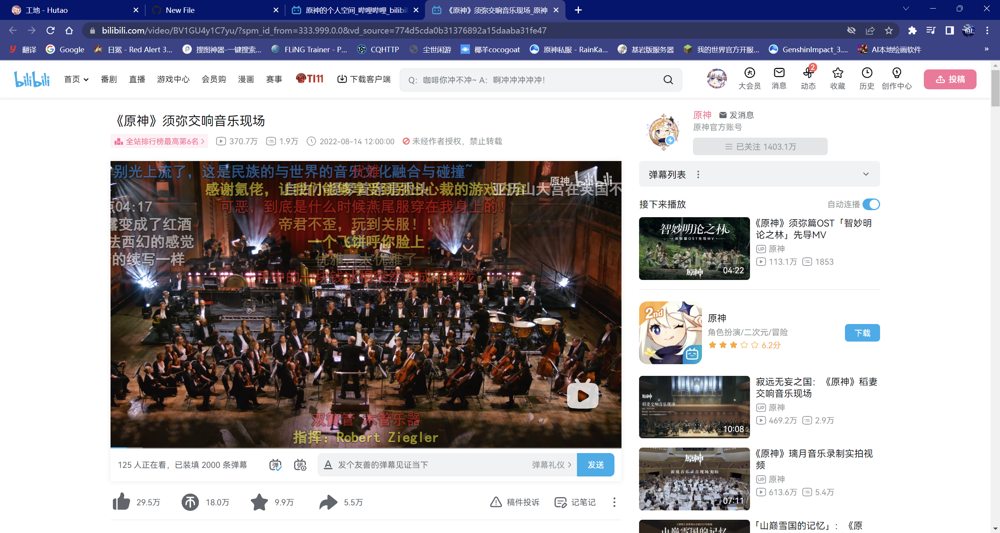

**旅人的韵律——《原神》游戏音乐的幕后

**《原神》璃月音乐录制实拍视频

**旅人的弦歌——《原神》璃月音乐的幕后

**「山巅雪国的记忆」：《原神》龙脊雪山OST印象曲MV

**寂远无妄之国：《原神》稻妻交响音乐现场

**「斩雾破竹」——《原神》稻妻OST战斗音乐MV

**旅人的幽思——《原神》稻妻音乐的幕后

**《原神》线上音乐会2021———「无际之旅的旋律」

**《原神》交响音乐会特别篇-「映春华章」

**《原神》须弥交响音乐现场

**《原神》线上音乐会2022 - 无际之旅的旋律

